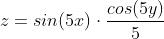
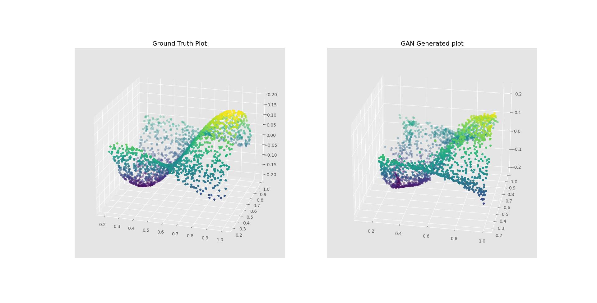

# Generative Adversarial Network - Ripple function
This is a simple GAN model to gain familiarity on the possibilities and challenges of this technology. The purpose of this model is to train a genereator able to replicate the following three-dimensional function:

The architectures of both the discriminator and the generator are as basic as it can get. The discriminator has 2 linear hidden layer that were initialized using the He weights initialization. The activation functions used were ReLU and Sigmoid. As for the generator, we used 2 linear hidden layer with the same initialization parameters. The activation functions used were ReLU and Tanh.

The following image displays how the model learnt:

